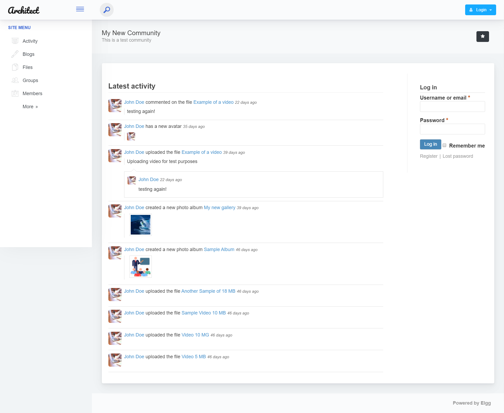

<h1>ArchitectUI Bootstrap 4 jQuery/HTML Theme for Elgg</h1>

ArchitectUI Bootstrap 4 Theme is a free responsive admin template built with Bootstrap 4. The template has an attractive yet simple and elegant design. The template is well crafted, with all the components neatly and carefully designed and arranged within the template.

ArchitectUI Bootstrap 4 Theme is packed with all the features that fit your needs but not cramped with components you would not even use. It is an excellent fit to build admin panels, e-commerce systems,  project management systems, CMS or CRM.

Although the template has a design like none other, it is easily customizable to suit your requirements. ArchitectUI Bootstrap 4 Theme comes with a clean and well-commented code that makes it easy to work with the template. Thus making it an ideal pick for jump starting your project.

<h1>Credits:</h1>

- Bootstrap 4
- Material Design Icons
- jQuery
- Chart.js

<h1>Browser Support:</h1>

ArchitectUI Bootstrap 4 Theme is designed to work flawlessly with all the latest and modern web browsers.

- Chrome (latest)
- FireFox (latest)
- Safari (latest)
- Opera (latest)
- IE10+  

<h1>License Information:</h1>

ArchitectUI Bootstrap 4 Theme is released under MIT license.

<h1>How to use ArchitectUI Bootstrap 4 Theme for elgg?</h1>

1 - Click the Clone or Download button in GitHub and download as a ZIP file or you can enter the command git clone https://github.com/rjcalifornia/architect-theme.git

2 - After the files have been downloaded you will get a folder with the plugin

3 - Put it at the end of the plugin list, and activate it

<h2>ArchitectUI Bootstrap 4 jQuery/HTML Theme Design</h2>

You can get the original template here:

https://github.com/DashboardPack/architectui-html-theme-free.git